#Resources Check
- Ondemand master 1 , 3 slave 2xlarge
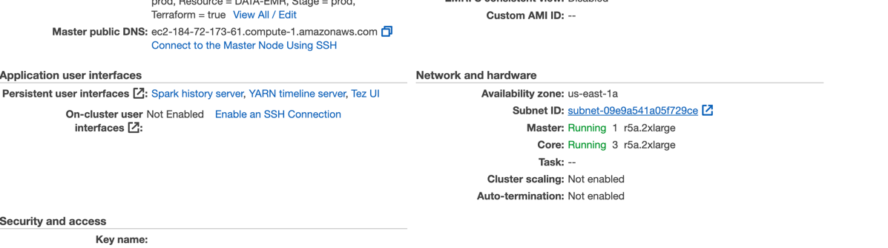

#To Run Terraform Script
- In order to run terraform script
- Make relevant changes in prod.tfvars
- 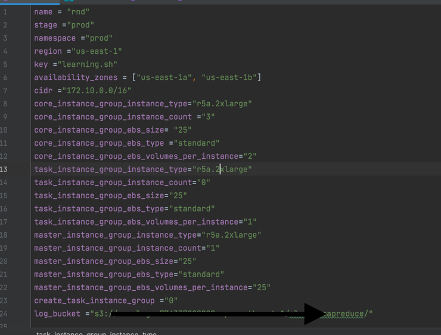
- cd emr
- terraform init
- terraform plan --var-file=prod.tfvars
- terraform apply --var-file=prod.tfvars

#PySpark Script
- As mentioned in requirement i generate 1000 records, but you can check it with just a paramter here
- 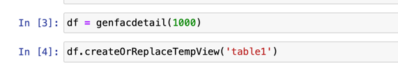
- Instead of 1000 , you can pass any value

#To Run Pyspark Script and Test
- As EMR is always behined the vpc for security reason , you just need to allow your own ip
- In order to allow follow these 2 steps
- 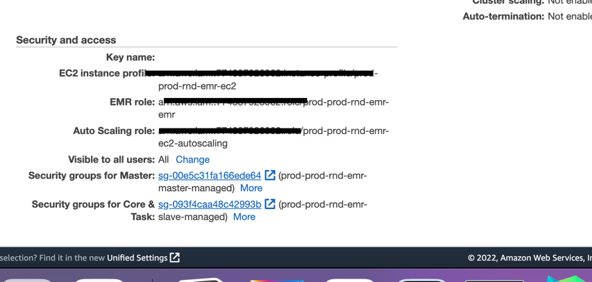
- click on security group for master
-select your sg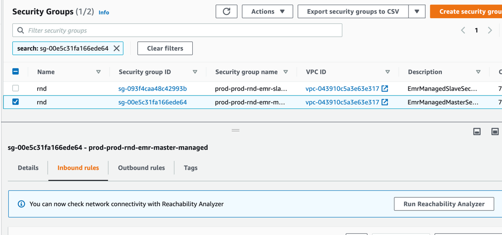
-click on inbound rule and add new rule , allow all traffic from my ip
-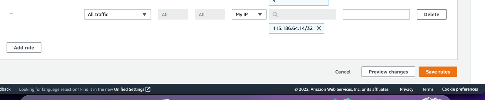
-do same for slave sg 
- 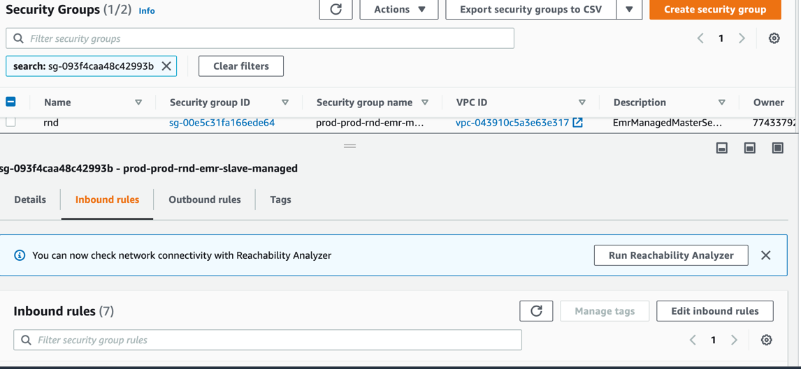
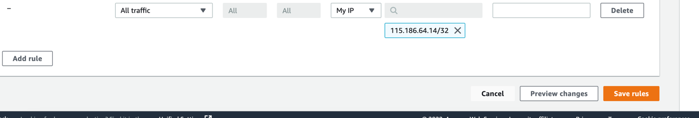-
- Now you can access any application 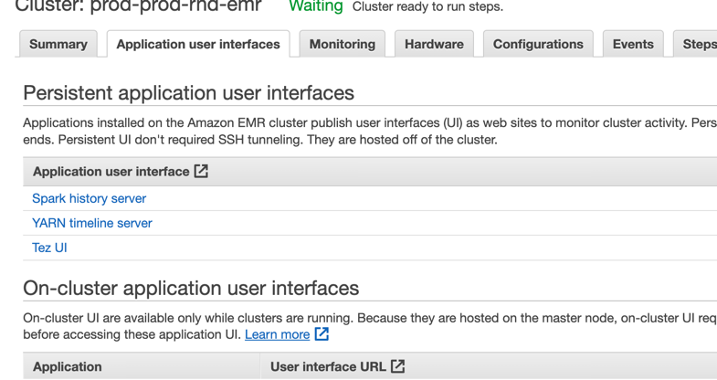
-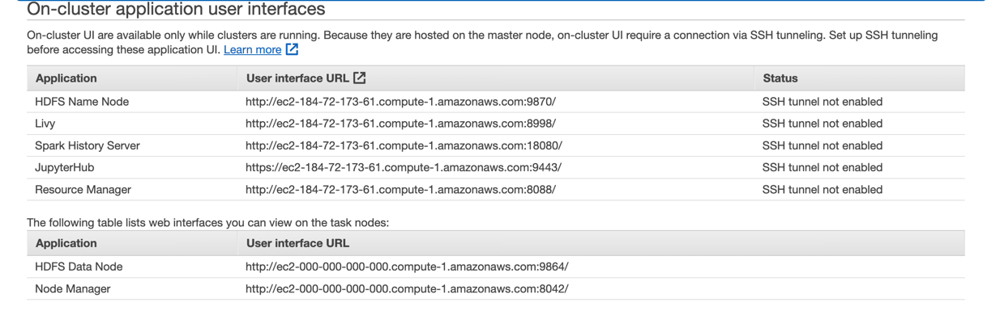
-In my case , jupyterHub ip is https://ec2-184-72-173-61.compute-1.amazonaws.com:9443/
- Username is jovyan
- Passowrd is  jupyter
- 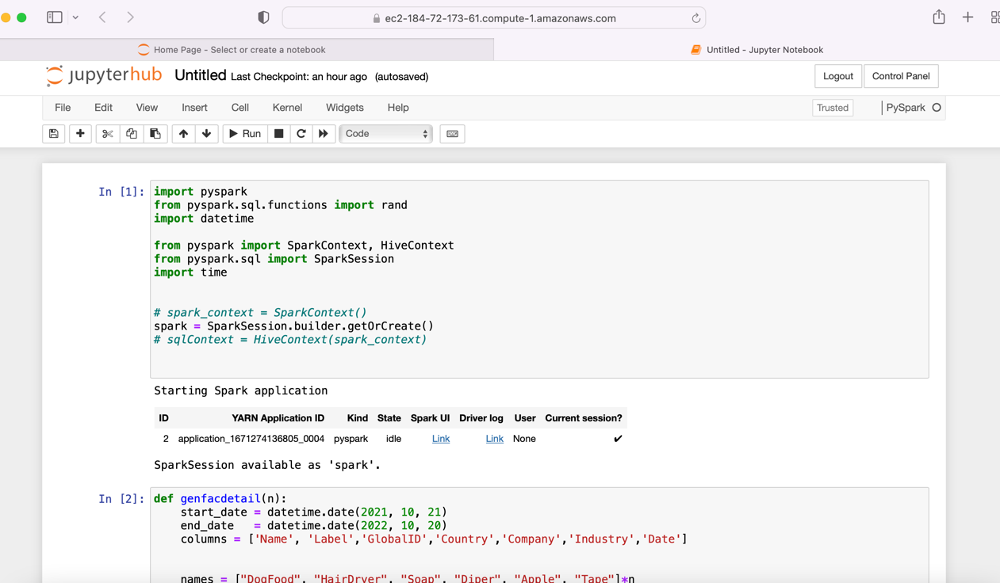


#Execution Time
- As spark is lazy evualation that's why i added .show()
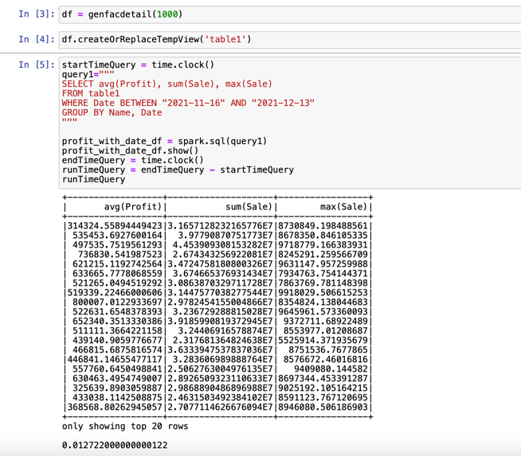
- when i display 1000 rows it takes
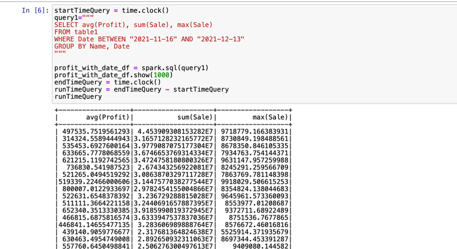
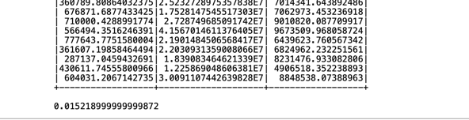

- query 2
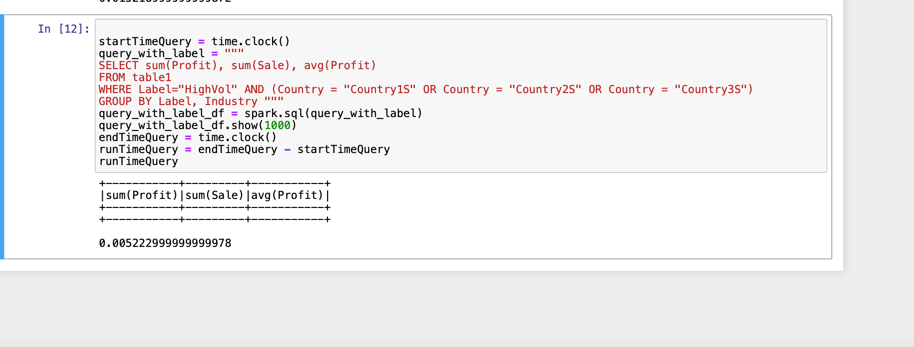
- so i changed query from AND to OR
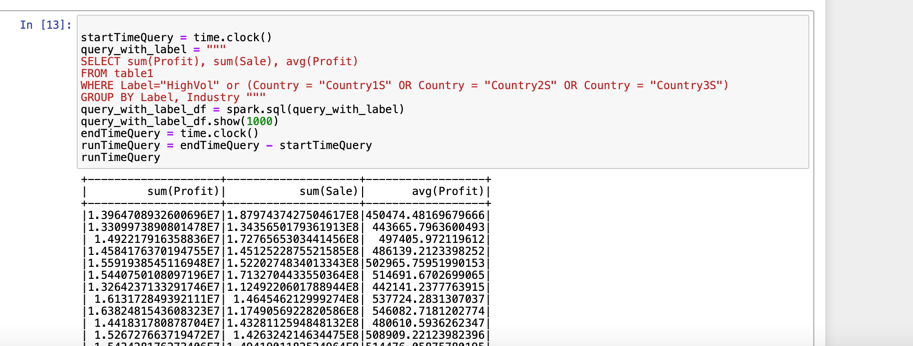
- 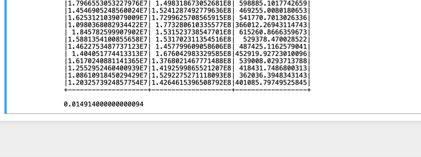 

```aidl

while 1 == 1:
    current_sec = timer()
    if current_sec == 30:
        break
    profit_with_date_df.count()
    
```
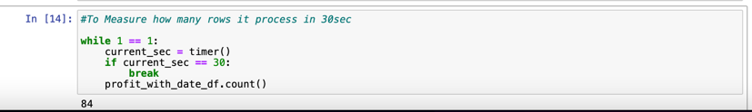